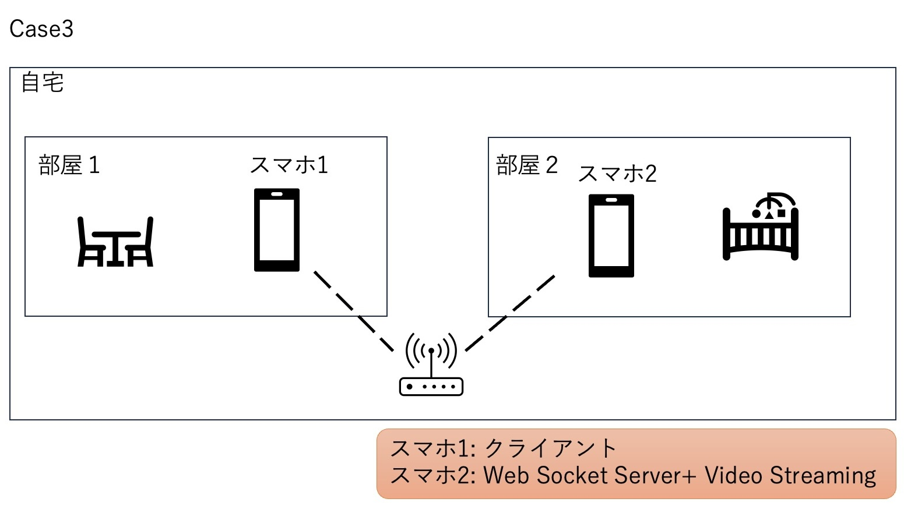
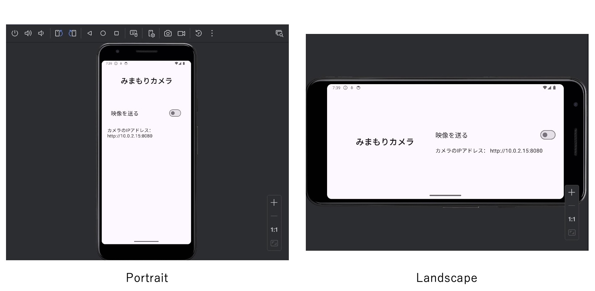
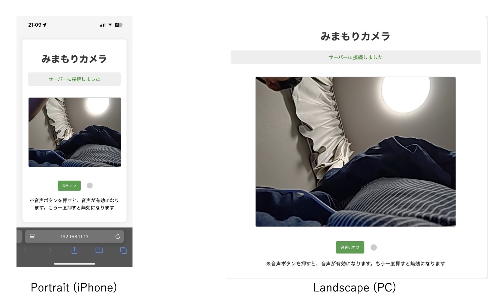

# このリポジトリについて

KotlinのKtorをつかって、Androidスマートフォンをサーバとし、映像と音声を他の端末に送信できるアプリです。  
Claude 3.7 Sonnetを使用して作りました。

小さな赤ちゃんがいるときに、みまもりカメラとして使うことを想定しています。  

# 特徴  

- スマートフォンがサーバ＋カメラになるため、色々な部屋に移動させて使用できる  

- 完全なローカルネットワークで動作する  

- 映像と音声を受信するクライアント端末はブラウザでよいため、iOS, Android, PCのどれでも使える  

# 動作画面

サーバとなるAndroidアプリの画面  

クライアント端末

# Know Issues

- 音声の送信か受信がうまくいっておらず、正しい音が伝わらない（何かの音が鳴っていることはわかる）  

 # 解説記事  
(思考中のことを書いた記事です。ご参考です)    
[Ktorを使って、Androidアプリとして動くシンプルなWebサーバを作ってみました (みまもりアプリ開発 1)](https://www.crossroad-tech.com/entry/ktor-android-server)

[Androidスマートフォンをサーバとして、別の部屋の映像を確認する方法 (みまもりアプリ開発2)](https://www.crossroad-tech.com/entry/android-server-video-stream)

[Androidスマートフォンをサーバにして、複数の端末から映像を確認する方法 (みまもりアプリ開発3)](https://www.crossroad-tech.com/entry/android-server-video-stream-app_1)

(このリポジトリの内容に対応した記事です)  
 [Androidスマートフォンをサーバにして、複数の端末から映像+音声を確認する方法 (みまもりアプリ開発4)](https://www.crossroad-tech.com/entry/android-server-video-stream-app_4)